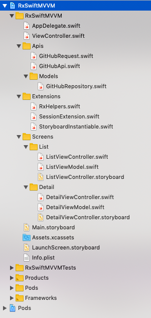

# MVVM with RxSwift

RxSwiftMVVM is an sample iOS App written in RxSwift using the MVVM architecture.  

[](https://swift.org)

## Sample App



### Run Sample 
1. Clone this repository.
    ```
    git clone git@github.com:yokurin/RxSwift-MVVM-iOS.git
    ```

2. Open `RxSwiftMVVM.xcworkspace` in Xcode. 

3. Run

## Description

RxSwiftMVVM is an sample iOS App written in RxSwift using the MVVM architecture.  

With [RxSwift](https://github.com/ReactiveX/RxSwift) , [RxSwiftCommunity/Action](https://github.com/RxSwiftCommunity/Action),  [APIKit](https://github.com/ishkawa/APIKit)

See Source code [here](https://github.com/yokurin/RxSwift-MVVM-iOS/tree/master/RxSwiftMVVM/Screens)

### Unit Test 

WIP ... 

### Xcode Template ( xctemplate )

WIP ...

## Requirements

- Xcode 10.2+
- Swift 5.0+

## Installation

```
git clone git@github.com:yokurin/RxSwift-MVVM-iOS.git
```

## See Also
### [yokurin/RxSwift-VIPER-iOS](https://github.com/yokurin/RxSwift-VIPER-iOS)


## Author

Tsubasa Hayashi, yoku.rin.99@gmail.com

## License

RxSwiftMVVM is available under the MIT license. See the LICENSE file for more info.
